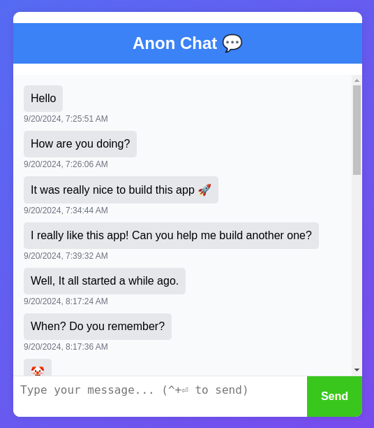

# 🚀 anon-chat-app 🗨️

Welcome to the Anonymous Chat App! 🎉

This project is a real-time chat platform where users can join anonymously and communicate with others via WebSockets.

No usernames, no tracking—just a simple, fun, and anonymous way to chat! 💬



## Features ✨

- **Real-time Messaging**: Instantly chat using WebSockets. ⚡
- **Anonymous Chat**: No sign-up needed—just join and start chatting! 🎭
- **Message History**: Access all previous messages upon connecting. 🔄
- **Quick Sending**: Use the send button or Ctrl + Enter for fast message delivery. 🚀
- **Message Counter**: Check total messages sent via the /count endpoint. 📊
- **Data Persistence**: Chat history is saved in a file and reloaded on server start. 📁

## Endpoints 📬

| Endpoint | Description |
| --- | --- |
| `/` | Home page |
| `/live` | WebSocket endpoint |
| `/count` | Total message count |

## Quick Start 🚀

### Docker run 🐳

```bash
docker run --rm -p 8080:8080 -d --name anon-chat-app dekuyo/anon-chat-app:latest
```

Then, navigate to `http://localhost:8080` in your browser to start chatting!

For persistent data storage, you can mount a volume to the container:

```bash
touch data.json
```

```bash
docker run --rm -p 8080:8080 -v $(pwd)/data.json:/app/data.json -d --name anon-chat-app dekuyo/anon-chat-app:latest
```

### Running Locally 🏠

**(1)** Clone the repository:

```bash
git clone github.com/escalopa/anon-chat-app
```

**(2)** Navigate to the project directory:

```bash
cd anon-chat-app
```

**(3)** Create storage file:

```bash
touch data.json
```

**(4)** Run the server:

```bash
docker compose up
```

**OR** using go

```bash
go run main.go
```

## Technologies 💻

GO | HTML | CSS | JavaScript | WebSockets | Docker

## Contributing 🤝

Feel free to submit issues, suggestions, or pull requests! Every contribution is welcome. 🚀

## Future Improvements 🛠️

- Add HTTPS support for secure connections.
- Add metrics with prometheus & grafana.

## License 📜

This project is licensed under the MIT License.

---

Enjoy your anonymous chat experience! 😎🎉

---
